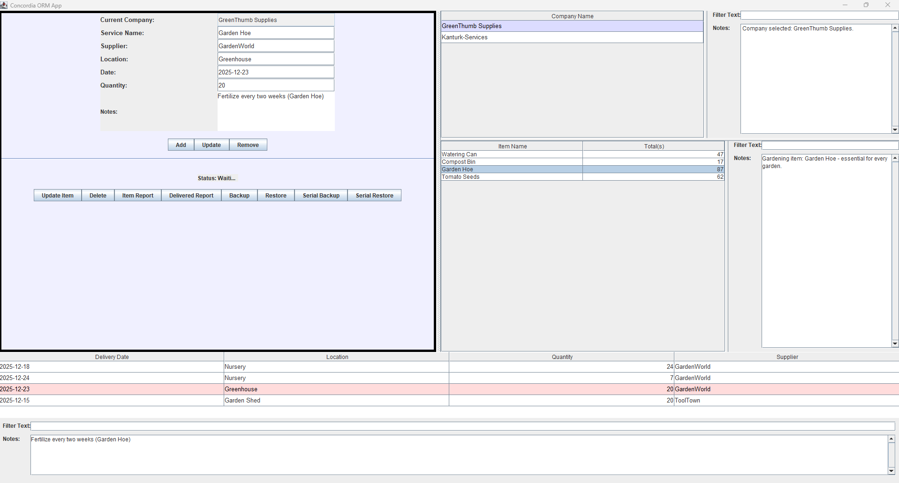
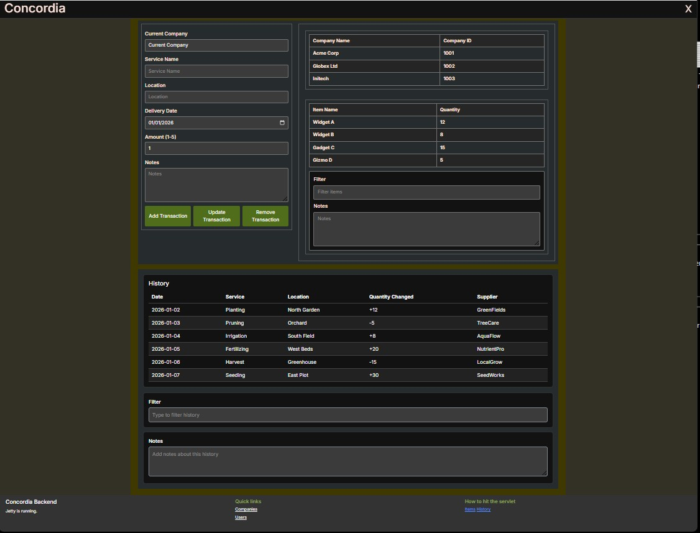

# Concordia

Swing app:<br>


Servlet: <br>


## Overview

---

# Concordia

**Project Overview:**  
"Concordia" takes an old **Java Swing** created in 2014, and uses **augmented AI**, to create a **swing front end locally and servlet for remote access from common code base**.

**Project Purpose:**

-   **Reorganize a legacy Concordia app into clean layers**<br><br>
    WareHouse<br>
    ├── domain (pure data + rules)<br>
    ├── repository (JDBC / persistence)<br>
    ├── service (business logic)<br>
    ├── controller (Concordia + Servlet adapters)<br>
    ├── ui (Concordia components only)<br>
    ├── infrastructure (bootstrapping, wiring)<br>

-   **Infrastructure** created within app negating any need for Spring or DI
-   **Annotations** as labels ( semantic markers)
-   **Remote Acccess** using **servlet**, **Local Access** application building on **Java Concordia libraries**
-   Integration of **augmented AI tools** to enhance development speed and functionality.
-   Fully **responsive design** for **Servlet** with attention to accessibility and user experience.

**Live Project:** [Harmonia](./swing-running.jpg)

<h2 align="center" id="TOC">Index</h2>

-   [Concordia](#concordia)
    -   [Overview](#overview)
    -   [Configuration](#configuration)
    -   [Schema](#postgres-schema)
-   [Concordia](#concordia-1)
    -   [Phases-one](#phases-one)
        -   [Domain first](#domain-first)
    -   [Phases-two](#phases-two)
        -   [Repository extraction](#repository-extraction)
        -   [Move database code without changing SQL](#move-database-code-without-changing-sql)
    -   [Phases-three](#phases-three)
        -   [Introduce Services (thin at first)](#introduce-services-thin-at-first)
    -   [Phases-four](#phases-four)
        -   [Controller layer (adapters)](#controller-layer-adapters)
    -   [Phases-five](#phases-five)
        -   [Clean the Concordia UI (liberation phase)](#clean-the-concordia-ui-liberation-phase)
    -   [Phases-six](#phases-six)
        -   [Infrastructure / Wiring](#infrastructure--wiring)
    -   [Phases-seven](#phases-seven)
        -   [Remove legacy shortcuts](#remove-legacy-shortcuts)
        -   [Annotations](#annotations)
        -   [Decouple](#decouple)
        -   [Annotations](#annotations-1)
    -   [Maven](#maven)
        -   [Maven Build Build file for project](#maven-build-build-file-for-project)
        -   [Adding Test Harness for Swing and servlet](#adding-test-harness-for-swing-and-servlet)
    -   ## [Adding JPA and Hibernate](#adding-jpa-and-hibernate)

## Postgres setup

---

### Configuration

---

<details>
    <summary>Details
    </summary>
            EDB Postgres® AI
            Get Postgres from a Builder, Not a

            18.1-2

            Set postgres password.

            Select default port 5432.

            Include pgAdmin for GUI management.

            Host: localhost

            Port: 5432 (default)

            Username: postgres

            Password: the one you set during installation

            sysdm.cpl

            psql -U postgres -h 127.0.0.1 -p 5432 -d concordia

</details>
<br>

[Back To Top](#configuration)

## Postgres schema

---

<details>
    <summary>Details
    </summary>
    ### Bullet list

\d+ company
\d+ item
\d+ users
\d+ history

\dt
List of tables
Schema | Name | Type | Owner
--------+---------+-------+----------
public | company | table | postgres
public | history | table | postgres
public | item | table | postgres
public | users | table | postgres
(4 rows)

concordia=# select\d+ company
Table "public.company"
Column | Type | Collation | Nullable | Default | Storage | Compression | Stats target | Description
---------------+------------------------+-----------+----------+---------------------------------------------+----------+-------------+--------------+-------------
company_id | integer | | not null | nextval('company_company_id_seq'::regclass) | plain | | |
company_title | character varying(25) | | | | extended | | |
company_name | character varying(255) | | | | extended | | |
Indexes:
"company_pkey" PRIMARY KEY, btree (company_id)
Not-null constraints:
"company_company_id_not_null" NOT NULL "company_id"
Access method: heap

concordia-# \d+ item
Table "public.item"
Column | Type | Collation | Nullable | Default | Storage | Compression | Stats target | Description
------------+--------------------------------+-----------+----------+---------------------------------------+----------+-------------+--------------+-------------
item_id | integer | | not null | nextval('item_item_id_seq'::regclass) | plain | | |
company_id | integer | | not null | | plain | | |
quantity | integer | | | | plain | | |
item_name | character varying(25) | | | | extended | | |
location | character varying(25) | | | | extended | | |
notes | character varying(200) | | | | extended | | |
date | timestamp(6) without time zone | | | | plain | | |
Indexes:
"item_pkey" PRIMARY KEY, btree (item_id)
Referenced by:
TABLE "history" CONSTRAINT "fkbtex7kw1vv34hjdy08rx6d1q5" FOREIGN KEY (item_id) REFERENCES item(item_id)
Not-null constraints:
"item_item_id_not_null" NOT NULL "item_id"
"item_company_id_not_null" NOT NULL "company_id"
Access method: heap

concordia-# \d+ users
Table "public.users"
Column | Type | Collation | Nullable | Default | Storage | Compression | Stats target | Description
---------------+-----------------------+-----------+----------+----------------------------------------+----------+-------------+--------------+-------------
user_id | integer | | not null | nextval('users_user_id_seq'::regclass) | plain | | |
user_name | character varying(25) | | | | extended | | |
user_password | character varying(25) | | not null | | extended | | |
company_id | integer | | not null | | plain | | |
Indexes:
"users_pkey" PRIMARY KEY, btree (user_id)
Not-null constraints:
"users_user_id_not_null" NOT NULL "user_id"
"users_user_password_not_null" NOT NULL "user_password"
"users_company_id_not_null" NOT NULL "company_id"
Access method: heap

concordia-# \d+ history
Table "public.history"
Column | Type | Collation | Nullable | Default | Storage | Compression | Stats target | Description
---------------+------------------------+-----------+----------+---------------------------------------------+----------+-------------+--------------+-------------
history_id | integer | | not null | nextval('history_history_id_seq'::regclass) | plain | | |
item_id | integer | | not null | | plain | | |
amount | integer | | | | plain | | |
location | character varying(25) | | | | extended | | |
provider | character varying(25) | | | | extended | | |
delivery_date | character varying(25) | | | | extended | | |
notes | character varying(200) | | | | extended | | |
Indexes:
"history_pkey" PRIMARY KEY, btree (history_id)
Foreign-key constraints:
"fkbtex7kw1vv34hjdy08rx6d1q5" FOREIGN KEY (item_id) REFERENCES item(item_id)
Not-null constraints:
"history_history_id_not_null" NOT NULL "history_id"
"history_item_id_not_null" NOT NULL "item_id"
Access method: heap

</details>
<br>

[Back To Top](#postgres-schema)

## Phases-one

---

### Domain first

<details>
    <summary>Details
    </summary>
    Phase 1 – Domain first 
        1️⃣ Move domain classes
            WareHouse.domain

        No logic changes
        Next, start with the domain layer. This is the safest step. Move your core model classes — Company, Item, history, User, Index — into a domain package. Do not add logic, do not add database code, do not add UI code. These classes should only represent data and relationships. Serialization is fine here.

</details>
<br>

[Back To Top](#concordia)

## Phases-two

---

### Repository extraction

<details>
    <summary>Details
    </summary>
        2️⃣ Create repository package
            WareHouse.repository
</details>

### Move database code without changing SQL

<details>
    <summary>Details
    </summary>
        3️⃣ Move database code without changing SQL

        | Old class         | New repository                                             |
        | ----------------- | ---------------------------------------------------------- |
        | `Databases`       | `CompanyRepository`, `ItemRepository`, `HistoryRepository` |
        | `DatabaseBackup`  | `BackupRepository`                                         |
        | `DatabaseRestore` | `RestoreRepository`                                        |
        | `Serialized`      | `FileBackupRepository`                                     |
        Rules:

            One repository = one persistence concern

            JDBC only here

            Repositories return domain objects

            Add labels:
            @Repository
            public class ItemRepository { ... }

        No behaviour change yet.

        After that, extract the repository layer. This is where most of your current code actually belongs. All JDBC and file persistence logic moves here. Your existing DatabaseBackup, DatabaseRestore, Serialized, and similar classes become repositories. Each repository should focus on one persistence responsibility. At this stage, you are still not improving logic — only relocating it. These classes can be labelled with @Repository as a semantic marker, even without Spring.

</details>

<br>

[Back To Top](#swing---clean---layers)

## Phases-three

---

### Introduce Services (thin at first)

<details>
    <summary>Details
    </summary>
       4️⃣ Create service package
        WareHouse.service

        Create thin services:

        InventoryService

        BackupService

        @Service
        public class BackupService {
            private final BackupRepository repo;

            public void backup(List<Company> companies) {
                repo.backup(companies);
            }
        }

        At this stage:

        Services mostly delegate

            That’s OK
        RestoreService
        Then introduce the service layer. Services sit above repositories and represent business use cases such as inventory management, backups, restores, or reporting. Initially, services can be very thin and simply delegate to repositories. That is expected and correct. Label them with @Service to make intent clear.

</details>

<br>

[Back To Top](#swing---clean---layers)

## Phases-four

---

### Controller layer (adapters)

<details>
    <summary>Details
    </summary>
        Phase 4 – Controller layer (adapters)
        5️⃣ Create controller package
            WareHouse.controller

            Purpose:

            Translate UI intent into service calls

            Controllers:

            InventoryController

            BackupController

            RestoreController

            Rules:

            Concordia talks only to controllers

            Controllers talk to services

            No JDBC

            No UI widgets in services


            @Component
            public class BackupController {
                private final BackupService service;

                public void backupPressed() {
                    service.backup();
                }
            }


        Next, add a controller layer. Controllers are the bridge between the Concordia UI (or servlets) and services. The UI should no longer call repositories or services directly. Controllers translate user actions like “Backup pressed” or “Delete item” into service calls. These are application controllers, not web controllers. Label them with @Component.

</details>
<br>

[Back To Top](#concordia)

## Phases-five

---

### Clean the Concordia UI (liberation phase)

<details>
    <summary>Details
    </summary>
        6️⃣ Simplify Concordia classes

        Now the UI becomes dumb (in a good way).

        Concordia does ONLY:

        Read text fields

        Show dialogs

        Call controller methods

        ❌ No SQL
        ❌ No business logic
        ❌ No static globals

        This is where Concordia suddenly becomes pleasant again.

        After that, clean up the Concordia UI. The UI should now only read user input, show dialogs, and call controller methods. There should be no SQL, no business logic, and no persistence code in Concordia classes. This is where Concordia becomes simple and manageable again.

</details>
<br>

[Back To Top](#concordia)

## Phases-six

---

### Infrastructure / Wiring

<details>
    <summary>Details
    </summary>

        WareHouse.infrastructure.ApplicationBootstrap sets up the database connection, repositories, service, controller, and launches the Mainframe.
        This centralizes all object creation and wiring, replacing the need for Spring or any DI framework. You can now launch your app from ApplicationBootstrap. #

</details>
<br>

[Back To Top](#concordia)

## Phases-seven

---

### Remove legacy shortcuts

<details>
    <summary>Details
    </summary>
    Only now:

        Remove static globals

        Remove maindriver.Company

        Remove hidden dependencies

        Remove circular references

        At this point:
        ✔ Testable
        ✔ Understandable
        ✔ Framework-ready (if you ever want Spring)


        Only at the end should you remove legacy shortcuts like static globals, hidden dependencies, and circular references. Do this last, when the structure is stable.

</details>
<br>

[Back To Top](#concordia)

## Phase 7 – Kill legacy shortcuts

---

<details>
    <summary>Details
    </summary>
Only now:

fully remove the old main or further refactor!

Remove static globals

Remove maindriver.Company

Remove hidden dependencies

Remove circular references

At this point:
✔ Testable
✔ Understandable
✔ Framework-ready include

Only at the end should you remove legacy shortcuts like static globals, hidden dependencies, and circular references. Do this last, when the structure is stable.

Annotations are labels, not magic:

@Repository

@Service

@Component

</details>

<br>

[Back To Top](#concordia)

### Annotations

---

<details>
    <summary>Details
    </summary>
    Semantic annotations are defined only as semantic markers- they do not carry meaning for humans (and future tools), but and have no runtime behaviour.
    They:
        do not create objects
        do not inject dependencies
        do not manage transactions
        do not change execution
    In this project @Service, @Repository, @Component, @Controller and @Transactional are used 
    They exist to say:
        “This class plays this role in the architecture.”

</details>
<br>

[Back To Top](#concordia)

### Decouple

---

<details>
    <summary>Details
    </summary>
    Introducing a real API boundary by decoupling the Swing client from the core application using HTTP-based Servlets.
    New Architecture
    backend/
        ├─ controller/      (Servlets = API boundary)<br>
        ├─ service/         (Business logic)<br>
        ├─ repository/      (JDBC)<br>
        ├─ domain/          (Entities)<br>
        ├─ dto/             (API models)<br>
        └─ infrastructure/  (DB, wiring)<br>
<br>
        swing-client/<br>
        ├─ ui/<br>
        ├─ http/<br>
        └─ dto/<br>
<br>
<br>
<br>
        ui/ — Swing screens & controllers<br>
                    JFrame, JPanel, JDialog<br>
                    Event handling<br>
                    Table models<br>
                    Input validation (UI-level only)<br>
 <br>                   
        http/ — API clients (boundary adapters)<br>
                    One class per backend resource<br>
                    Builds HTTP requests<br>
                    Handles status codes<br>
                    Maps JSON ↔ DTOs<br>
  <br>      
        dto/ — data transfer objects<br>
                    Plain data objects (POJOS)<br>
                    Serializable to/from JSON<br>
<br>
        🧠 How data flows (end-to-end)<br>
                [User clicks button]<br>
                        ↓<br>
                UI (ui/)<br>
                        ↓
                        ↓<br>
                HTTP client (http/)<br>
                        ↓   JSON over HTTP<br>
                Backend Servlet<br>
                        ↓<br>
                HTTP response<br>
                        ↓<br>
                DTOs<br>
                        ↓<br>
                UI updates<br><br>

        What Swing actually sends
            From Swing:
                GET /api/concordia?type=item
                GET /api/concordia?type=history
                GET /api/concordia?type=company
                GET /api/concordia?type=user
                POST /api/concordia?type=item
                POST /api/concordia?type=history
                PUT /api/concordia?type=item
                PUT /api/concordia?type=history
                DELETE /api/concordia?type=item&id=...
                DELETE /api/concordia?type=history&id=...
            With:
            JSON payloads
            HTTP status codes

<br>
        Servlet: 
            Thin controllers by design
            REST encourages:
                No session state

            @WebServlet("/users")
            public class UserServlet {
                private final UserService userService;
        }

        4️⃣ REST Servlet (API boundary)
                controller/ConciordiaServlet.java

                public class ConcordiaServlet extends HttpServlet {
                private ObjectMapper mapper;
                private CompanyRepository companyRepo;
                private ItemRepository itemRepo;
                private HistoryRepository historyRepo;
                private UserRepository userRepo;

                @Override
                    public void init() {
                        try {
                            Connection con = DriverManager.getConnection(
                                "jdbc:postgresql://127.0.0.1:5432/concordia", "postgres", "password");
                            companyRepo = new CompanyRepository(con);
                            itemRepo = new ItemRepository(con);
                            historyRepo = new HistoryRepository(con);
                            userRepo = new UserRepository(con);
                            mapper = new ObjectMapper();
                        } catch (SQLException e) {
                            throw new RuntimeException("Database connection failed", e);
                        }
                    }

        @Override
        protected void doGet(HttpServletRequest req, HttpServletResponse resp) throws IOException {

🔥 This is the hard boundary
Everything dangerous stays behind it.

        The annotation:
        Adds no behavior
        Declares intent
        Makes future automation possible

</details>
<br>

[Back To Top](#concordia)

### Decoupling

---

<details>
    <summary>Details
    </summary>
    decoupling of your Java Swing client from the backend using HTTP-based Servlets. Here’s a concise summary and explanation:

    Key Points:

    The Swing client (swing-client/) communicates with the backend (backend/) only via HTTP/JSON, not by calling Java classes directly.
    The backend is organized into clear layers: controller (Servlets as API boundary), service (business logic), repository (JDBC), domain (entities), dto (API models), and infrastructure (wiring, DB).
    The Swing client is split into ui (screens/controllers), http (API clients), and dto (data transfer objects).
    Data flow: User interacts with UI → HTTP client sends JSON over HTTP → Backend Servlet processes and responds → UI updates with DTOs.
    Example API calls: GET /api/products, POST /api/orders, PUT /api/stock/42, all using JSON payloads and HTTP status codes.
    Servlets act as thin controllers, with no session state, and map entities to DTOs for the API.
    Annotations like @WebServlet, @Service, @Repository, etc., are used as semantic markers only—they declare intent but add no runtime behavior.
    Purpose:

    This “hard boundary” ensures the UI is fully decoupled from backend logic and persistence, making the system more maintainable, testable, and ready for future automation or framework changes.
    If you need help implementing this structure, creating DTOs, or wiring up the HTTP client or Servlets, let me know your next step!

</details>
<br>

[Back To Top](#concordia)

## Maven

### Maven Build Build file for project

---

<details>
    <summary>Details
    </summary>
    Full project structure
```text
        concordia/                     <-- project root <br> 
    ├─ pom.xml                        <-- Maven POM (builds WAR + Swing JAR) <br> 
    ├─ src/Concordia/                 <-- all Java source files <br> 
    │   ├─ annotations/               <-- custom backend annotations <br> 
    │   │   └─ (e.g., Repository.java, Service.java) <br> 
    │   ├─ controller/                <-- Servlets / REST controllers <br> 
    │   │   └─ ConcordiaServlet.java <br> 
    │   ├─ domain/                    <-- domain entities (backend) <br> 
    │   │   └─ Company.java <br> 
    │   │   └─ Item.java <br> 
    │   │   └─ User.java <br> 
    │   │   └─ History.java <br> 
    │   ├─ dto/                       <-- DTO classes <br> 
    │   │   └─ CompanyDto.java <br> 
    │   │   └─ ItemDto.java <br> 
    │   │   └─ UserDto.java <br> 
    │   │   └─ HistoryDto.java <br> 
    │   ├─ infrastructure/            <-- utility classes, configs <br> 
    │   │   └─ DBConnection.java <br> 
    │   │   └─ AppConfig.java <br> 
    │   ├─ repository/                <-- DAO / database access <br> 
    │   │   └─ CompanyRepository.java <br> 
    │   │   └─ ItemRepository.java <br> 
    │   │   └─ UserRepository.java <br> 
    │   │   └─ HistoryRepository.java <br> 
    │   ├─ service/                   <-- business logic <br> 
    │   │   └─ CompanyService.java <br> 
    │   │   └─ ItemService.java <br> 
    │   │   └─ UserService.java <br> 
    │   │   └─ HistoryService.java <br> 
    │   ├─ Main.java                  <-- Swing main class (entry point) <br> 
    │   ├─ MainDriver.java            <-- additional Swing launcher <br> 
    │   ├─ AdminPanel.java            <-- Swing admin panel <br> 
    │   ├─ CompanyItemTablePanel.java <-- Swing table panel <br> 
    │   └─ (any other Swing UI classes) <br> 
    ├─ webapp/                        <-- web resources for WAR <br> 
    │   ├─ WEB-INF/ <br> 
    │   │   └─ web.xml                <-- optional servlet config <br> 
    │   └─ (static files / JSPs) <br> 
    ├─ target/                        <-- Maven build output <br> 
    │   ├─ classes/                   <-- compiled .class files <br> 
    │   │   └─ Concordia/             <-- package folders reflect src/Concordia <br> 
    │   ├─ concordia-backend.war      <-- WAR for Jetty deployment <br> 
    │   └─ concordia-swing.jar        <-- Runnable Swing JAR <br>
```

Notes

-   Swing files (Main.java, MainDriver.java, AdminPanel.java, CompanyItemTablePanel.java) are directly under src/Concordia/.

-   Backend folders (controller, domain, dto, repository, service, etc.) are all in the same src/Concordia/ root.

-   Maven will compile all .java files in src/Concordia/ into target/classes/Concordia/....

-   The main.class in the POM should point to the class with the Swing main() method, e.g.:

<main.class>Concordia.Main</main.class>

-   Your WAR will only include backend + web resources; the Swing JAR is separate.

</details>
<br>

[Back To Top](#concordia)

### Adding Test Harness for Swing and servlet

<details>
    <summary>Details
    </summary>
    ### Adding test for project

    The shared domain 'Shared-Domain'  module  is now set up and built successfully.
    Added the domain module as a dependency in both pom.xml and pom.xml.
    Fixed pom.xml structure:

    Both web-app and swing-app now have poms pointing to the domain classes, and tests for domain classes(The test CompanyTest, historyTest,ItemTest and users all runs and passes.) now compile and pass.

    All Maven modules build and install without errors.

    Your project now follows best practices for shared code in a multi-module Maven setup.

    Moved all domain classes to the new module:

</details>

<br>

[Back To Top](#concordia)

### Adding JPA and Hibernate

---

<details>
    <summary>Details
    </summary>

    Define entity classes for your tables.
    Replace raw JDBC calls in your DAO/repository layer with JPA/Hibernate code:
    EntityManager or JpaRepository for CRUD operations.
    Make sure your transaction handling is clear (@Transactional if using Spring or manual if framework-free).
    Reason: Doing this after tests ensures that your ORM code can be validated against real data and tested via your test framework.

    Step 4: Update database contents
    After JPA is set up, you can use either:
    JPA save/update methods
    SQL scripts (via data.sql in Maven resources or via JPA’s EntityManager.createNativeQuery())
    Reason: You can now safely update contents and verify via tests that your ORM layer works as expected.


    Refactor to JPA/ORM

    JPA code
    ↓
    JPA spec
    ↓
    Hibernate (implementation you included)
    ↓
    JDBC
    ↓
    PostgreSQL

    Your code → JPA (interfaces)
          → Hibernate (implementation)
          → JDBC
          → PostgreSQL

Maven setup:<br> - jakarta.persistence-api → JPA spec<br> - hibernate-core → JPA implementation<br> - postgresql → JDBC driver<br>

```xml
    <dependencies>
    <!-- JPA API (interfaces + annotations) -->
    <dependency>
    <groupId>jakarta.persistence</groupId>
    <artifactId>jakarta.persistence-api</artifactId>
    <version>3.1.0</version>
    </dependency>
    <!-- Hibernate = JPA implementation -->
    <dependency>
    <groupId>org.hibernate.orm</groupId>
    <artifactId>hibernate-core</artifactId>
    <version>6.4.4.Final</version>
    </dependency>
    <!-- PostgreSQL JDBC driver -->
    <dependency>
    <groupId>org.postgresql</groupId>
    <artifactId>postgresql</artifactId>
    <version>42.7.3</version>
    </dependency>
    </dependencies>
```

src/main/resources/META-INF/persistence.xml

-   Correct namespace
-   Correct RESOURCE_LOCAL usage
-   Correct Hibernate provider
-   Correct JDBC properties
-   Correct Hibernate properties

    ```xml
        <?xml version="1.0" encoding="UTF-8"?>
        <persistence xmlns="https://jakarta.ee/xml/ns/persistence"
                    version="3.0">
            <persistence-unit name="concordiaPU" transaction-type="RESOURCE_LOCAL">
                <!-- Tell JPA to use Hibernate -->
                <provider>org.hibernate.jpa.HibernatePersistenceProvider</provider>
                <!-- Your entities -->
                <class>com.concordia.domain.User</class>
                <properties>
                    <!-- DB -->
                    <property name="jakarta.persistence.jdbc.url"
                            value="jdbc:postgresql://localhost:5432/concordia"/>
                    <property name="jakarta.persistence.jdbc.user" value="postgres"/>
                    <property name="jakarta.persistence.jdbc.password" value="postgres"/>
                    <!-- Hibernate settings -->
                    <property name="hibernate.dialect"
                            value="org.hibernate.dialect.PostgreSQLDialect"/>
                    <property name="hibernate.hbm2ddl.auto" value="validate"/>
                    <property name="hibernate.show_sql" value="true"/>
                </properties>
            </persistence-unit>
        </persistence>
    ```

#### Runtime database overrides (web-app)

The servlet now honors optional overrides, so you can keep `persistence.xml` checked in with safe defaults and inject the real credentials through environment variables (or matching JVM system properties) before launching Jetty:

```powershell
$env:CONCORDIA_DB_URL = "jdbc:postgresql://127.0.0.1:5432/concordia"
$env:CONCORDIA_DB_USER = "postgres"
$env:CONCORDIA_DB_PASSWORD = "<your-password>"
./start-jetty.ps1
```

Linux/macOS shells can export the same names. If no overrides are provided the values from `web-app/src/main/resources/META-INF/persistence.xml` remain in effect.

1. Entity (pure JPA)

    ```java
        package com.concordia.domain;
        import jakarta.persistence.*;
        @Entity
        @Table(name = "users")
        public class User {

            @Id
            @GeneratedValue
            private Long id;

            private String email;

            // getters/setters
        }
    ```

2. Bootstrap (Infrastructure layer)

    ```java
         EntityManagerFactory emf =
         Persistence.createEntityManagerFactory("concordiaPU");
    ```

    Hibernate is now running underneath.<br>

3. Repository (JPA only)

    ```java
        public class UserRepository {

            private final EntityManager em;

            public UserRepository(EntityManager em) {
                this.em = em;
            }

            public void save(User user) {
                em.persist(user);
            }

            public User find(Long id) {
                return em.find(User.class, id);
            }
        }
    ```

4. Transaction<br>

    ```java
        EntityManager em = emf.createEntityManager();
        EntityTransaction tx = em.getTransaction();

        try {
            tx.begin();
            repo.save(user);
            tx.commit();
        }
        catch (Exception e) {
            tx.rollback();
            throw e;
        } finally {
        em.close();
        }
    ```

    This is exactly what Spring normally hides. “JPA with Hibernate, without Spring, done properly.”

<br>

[Back To Top](#concordia)

### ORM Added

---

<details>
     <summary>Details
    </summary>
To refactor your Swing app for JPA/ORM, you need to:

-   Replace all direct JDBC `Connection` usage with JPA's `EntityManager`. - Refactor repository and service classes to use JPA instead of JDBC. - Update the initialization logic (e.g., in InitDatabase) to create an `EntityManagerFactory` and `EntityManager`, and inject them into your repositories/services.

**1. Update InitDatabase.java to use JPA:**

-   Replace `Connection con = DriverManager.getConnection(...)` with JPA setup:

```java
import jakarta.persistence.EntityManagerFactory;
import jakarta.persistence.EntityManager;
import jakarta.persistence.Persistence;

EntityManagerFactory emf = Persistence.createEntityManagerFactory("test-pu");
EntityManager em = emf.createEntityManager();
Databases db = new Databases(em);
// Use db ORM methods here
em.close();
emf.close();
```

**2. Refactor repositories (CompanyRepository, ItemRepository, HistoryRepository):**

-   Change constructors to accept `EntityManager` instead of `Connection`.
-   Replace all SQL and JDBC code with JPA queries and entity operations.

**3. Refactor InventoryService and InventoryController:**

-   Update to use the new JPA-based repositories.

**4. Update AdminPanel and other UI classes:**

-   Ensure all data operations go through the refactored controller/service.

</details>

<br>

[Back To Top](#concordia)
