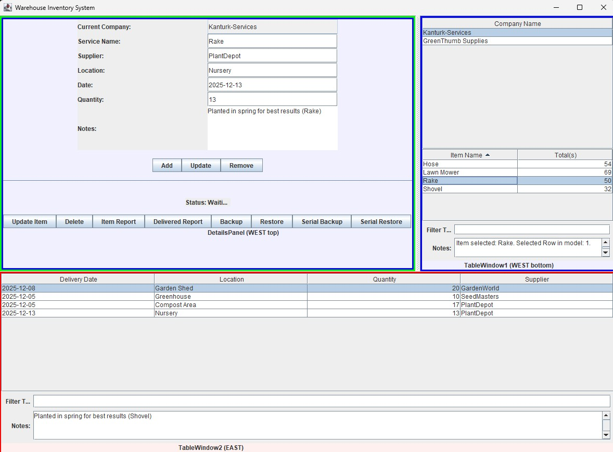

# Swing - Clean - Layers

## Overview
---

# swing-clean-layers

**Project Overview:**  
"Swing Clean Layers"  demonstrates my skills in **Java Swing**, along with **augmented AI**, to create a **swing front end locally and servlet for remote access**.  

**Project Purpose:**  
- **Reorganize a legacy Swing app into clean layers**
- **Target layers** 
        WareHouse 
        ├── domain        (pure data + rules) 
        ├── repository    (JDBC / persistence) 
        ├── service       (business logic) 
        ├── controller    (Swing + Servlet adapters) 
        ├── ui            (Swing components only) 
        ├── infrastructure (bootstrapping, wiring) 
        
- **Annotations** as labels, **@Repository @Service @Component**
- **Remote Acccess** using **servlet**
- Integration of **augmented AI tools** to enhance development speed and functionality.  
- Fully **responsive design** for **Servlet** with attention to accessibility and user experience.  

**Live Project:** [Harmonia](#)  

<h2 align="center" id="TOC">Index</h2>

- [Swing - Clean - Layers](#swing---clean---layers)
  - [Overview](#overview)
- [swing-clean-layers](#swing-clean-layers)
  - [Phases-one](#phases-one)
    - [Domain first](#domain-first)
  - [Phases-two](#phases-two)
    - [Repository extraction](#repository-extraction)
    - [Move database code without changing SQL](#move-database-code-without-changing-sql)
  - [Phases-three](#phases-three)
    - [Introduce Services (thin at first)](#introduce-services-thin-at-first)
  - [Phases-four](#phases-four)
    - [Controller layer (adapters)](#controller-layer-adapters)
  - [Phases-five](#phases-five)
    - [Clean the Swing UI (liberation phase)](#clean-the-swing-ui-liberation-phase)
  - [Phases-six](#phases-six)
    - [Infrastructure / Wiring](#infrastructure--wiring)
  - [Phases-seven](#phases-seven)
    - [Kill legacy shortcuts](#kill-legacy-shortcuts)
    - [User Stories](#user-stories)
    - [Wireframes](#wireframes)
    - [Colour Scheme](#colour-scheme)
    - [Fonts](#fonts)
  - [Features](#features)
    - [Responsivity](#responsivity)
  - [Improvements](#improvements)
  - [Deployment](#deployment)
  - [Testing and Validation](#testing-and-validation)
      - [HTML Validation](#html-validation)
      - [CSS Validation](#css-validation)
      - [Python Validation](#python-validation)
      - [JS Validation](#js-validation)
      - [Lighthouse](#lighthouse)
      - [Automated Testing](#automated-testing)
      - [Manual Testing](#manual-testing)
- [Manual Testing](#manual-testing-1)
  - [AI Implementation](#ai-implementation)
    - [Code Creation](#code-creation)
    - [Debugging](#debugging)
    - [Performance and Experience](#performance-and-experience)
    - [Development Process](#development-process)
  - [Database](#database)
  - [References](#references)
  - [Tech Employed](#tech-employed)
  - [Learning Points](#learning-points)

## Phases-one
---

### Domain first

    
Details
    

    Phase 1 – Domain first 
        1️⃣ Move domain classes
            WareHouse.domain

        No logic changes
        Next, start with the domain layer. This is the safest step. Move your core model classes — Company, Item, history, User, Index — into a domain package. Do not add logic, do not add database code, do not add UI code. These classes should only represent data and relationships. Serialization is fine here.

 

[Back To Top](#swing---clean---layers)

## Phases-two
---

### Repository extraction 

    
Details
    

        2️⃣ Create repository package
            WareHouse.repository

### Move database code without changing SQL

    
Details
    

        3️⃣ Move database code without changing SQL

        | Old class         | New repository                                             |
        | ----------------- | ---------------------------------------------------------- |
        | `Databases`       | `CompanyRepository`, `ItemRepository`, `HistoryRepository` |
        | `DatabaseBackup`  | `BackupRepository`                                         |
        | `DatabaseRestore` | `RestoreRepository`                                        |
        | `Serialized`      | `FileBackupRepository`                                     |
        Rules:

            One repository = one persistence concern

            JDBC only here

            Repositories return domain objects

            Add labels:
            @Repository
            public class ItemRepository { ... }

        No behaviour change yet.

        After that, extract the repository layer. This is where most of your current code actually belongs. All JDBC and file persistence logic moves here. Your existing DatabaseBackup, DatabaseRestore, Serialized, and similar classes become repositories. Each repository should focus on one persistence responsibility. At this stage, you are still not improving logic — only relocating it. These classes can be labelled with @Repository as a semantic marker, even without Spring.

 

[Back To Top](#swing---clean---layers)

## Phases-three
---

### Introduce Services (thin at first)
    

    
Details
    

       4️⃣ Create service package
        WareHouse.service

        Create thin services:

        InventoryService

        BackupService

        @Service
        public class BackupService {
            private final BackupRepository repo;

            public void backup(List<Company> companies) {
                repo.backup(companies);
            }
        }

        At this stage:

        Services mostly delegate

            That’s OK
        RestoreService
        Then introduce the service layer. Services sit above repositories and represent business use cases such as inventory management, backups, restores, or reporting. Initially, services can be very thin and simply delegate to repositories. That is expected and correct. Label them with @Service to make intent clear.

 

[Back To Top](#swing---clean---layers)

## Phases-four
---

###  Controller layer (adapters)

    
Details
    

        Phase 4 – Controller layer (adapters)
        5️⃣ Create controller package
            WareHouse.controller

            Purpose:

            Translate UI intent into service calls

            Controllers:

            InventoryController

            BackupController

            RestoreController

            Rules:

            Swing talks only to controllers

            Controllers talk to services

            No JDBC

            No UI widgets in services

            @Component
            public class BackupController {
                private final BackupService service;

                public void backupPressed() {
                    service.backup();
                }
            }

        Next, add a controller layer. Controllers are the bridge between the Swing UI (or servlets) and services. The UI should no longer call repositories or services directly. Controllers translate user actions like “Backup pressed” or “Delete item” into service calls. These are application controllers, not web controllers. Label them with @Component.

 

[Back To Top](#swing---clean---layers)

## Phases-five
---

### Clean the Swing UI (liberation phase)

    
Details
    

        6️⃣ Simplify Swing classes

        Now the UI becomes dumb (in a good way).

        Swing does ONLY:

        Read text fields

        Show dialogs

        Call controller methods

        ❌ No SQL
        ❌ No business logic
        ❌ No static globals

        This is where Swing suddenly becomes pleasant again.

        After that, clean up the Swing UI. The UI should now only read user input, show dialogs, and call controller methods. There should be no SQL, no business logic, and no persistence code in Swing classes. This is where Swing becomes simple and manageable again.

 

[Back To Top](#swing---clean---layers)

## Phases-six
---

### Infrastructure / Wiring

    
Details
    

        7️⃣ Centralise object creation

        Create:

            WareHouse.infrastructure

        Add:

                public class ApplicationBootstrap {
                public static void main(String[] args) {
                    Connection con = ...
                    ItemRepository itemRepo = new ItemRepository(con);
                    InventoryService service = new InventoryService(itemRepo);
                    InventoryController controller = new InventoryController(service);
                    new MainFrame(controller);
                }
            }

        This replaces Spring by hand.

        Then introduce an infrastructure or bootstrap layer. This is where you manually wire everything together since you are not using Spring. You create the database connection, repositories, services, controllers, and pass controllers into the UI. This replaces dependency injection frameworks with explicit construction.

 

[Back To Top](#swing---clean---layers)

## Phases-seven
---

### Kill legacy shortcuts

    
Details
    

    Only now:

        Remove static globals

        Remove maindriver.Company

        Remove hidden dependencies

        Remove circular references

        At this point:
        ✔ Testable
        ✔ Understandable
        ✔ Framework-ready (if you ever want Spring)

        Only at the end should you remove legacy shortcuts like static globals, hidden dependencies, and circular references. Do this last, when the structure is stable.

 

[Back To Top](#swing---clean---layers)

### User Stories

  
Details

  

    <ul>
      <li>Authentication & Profiles
        <ul>
          <li> As a SuperUser, I want to manage users, services, and bookings efficiently.</li>
          <li> As a SuperUser, I can edit profiles to keep user information up to date.</li>
          <li> As a SuperUser, I can moderate blogs and comments to ensure content is relevant and appropriate.</li>
          <li> As a User, I can successfully log in so that I can securely edit blogs/comments.</li>
          <li> As a Guest, I can register so that I can contribute blogs/comments securely.</li>
        </ul>
      </li>
      <li>Blog Management
        <ul>
          <li>Registered User can create blogs, adding to gardening knowledge pool.</li>
          <li>Guest can read all blogs.</li>
          <li>Registered User can update their blogs.</li>
          <li>Registered User can delete their blogs.</li>
        </ul>
      </li>
      <li>Comment Management
        <ul>
          <li>Visiting guest can create comments, adding to blog's knowledge pool.</li>
          <li>Visiting guest can read comments.</li>
          <li>Returning guest or registered User can update their comments.</li>
          <li>Returning guest or registered User can delete their comments.</li>
        </ul>
      </li>
      <li>Shopping Cart / Booking Creation
        <ul>
          <li>Visiting guest can create a shopping cart persisted in stored cookies or session data.</li>
          <li>Visiting guest can create a booking to complete a transaction. Information is retrieved from stored cookies or session data.</li>
          <li>Registered User can create a shopping cart.</li>
          <li>Registered User can create a booking to complete a transaction. Information is retrieved from the shopping cart.</li>
        </ul>
      </li>
      <li>Booking Management
        <ul>
          <li>As a SuperUser, I can approve bookings. Information is retrieved from Bookings.</li>
        </ul>
      </li>
    </ul>
  

### Wireframes

  

    
Mobile pages logged in

    
  

  

    
Mobile pages logged out

    
  

  

    
XL and Large Home Page

    
  

  

    
XL and Large Blog Page

    
  

  

    
XL and Large Comments Page

    
  

  

    
XL Services Page

    
  

  

    
Large Services Page

    
  

  

    
Large and XL Booking Page

    
  

  

    
Large and XL Registration Page

    
  

### Colour Scheme

There are a lot of colours in a garden already so I used , one PRIMARY colour for all text except a SECONDARY colour for a Call to Action and the use of whitespace where appropiate.
The main page is using the design principle of thirds to create a more balanced and interesting composition.

I used image picker website to choose a colour scheme https://imagecolorpicker.com/
The image is

Click to image from which  colour palette generated

 

   

Details

I used one **PRIMARY** colour for all text, a **SECONDARY** colour for the Call to Action, and whitespace appropriately.  
The main page uses the **rule of thirds** for a balanced composition.  
Colours were selected using [Image Color Picker](https://imagecolorpicker.com/).

| Main Palette       | Hex       | Usage                                   |
|-------------------|-----------|----------------------------------------|
| Flax              | #E9D98A   | Background                              |
| Dark Moss Green   | #506D1B   | CTA / Secondary colour                  |
| Ecru              | #C9B66B   | Highlight links / hover effects         |
| Eggshell          | #E6E2D2   | Background areas or cards               |
| Davy’s Grey       | #4D4D4D   | Primary colour / text                   |

Accessibility checks were done with [Colour Contrast Checker](https://colourcontrast.cc/), [WebAIM](https://webaim.org/resources/contrastchecker/), and [Adobe Color](https://color.adobe.com/create/color-contrast-analyzer).

Click to view Colour Contrast Checker results

Click to view WebAIM results

Click to view Adobe Color results

### Fonts

  
Details

    

      Similar to colour, the font should be easy to read.  
      Therefore, only **one font, Inter**, is necessary for titles, body text, and the call to action (CTA).     
      This was implemented through Google Fonts using a direct import within the `style.css` file.  
  

  

    <code>
    /* Google Fonts import */
    @import url('https://fonts.googleapis.com/css2?family=Inter:wght@100..900&family=Macondo&display=swap');
    </code>
  

 

[Back To Top](#harmonia)

## Features
--- 

  
Project Features & Pages

  

    

      
Home Page

      There is a fold in the page by design.  
        
      
      
    

  

  

    

      
Login Page

      Login Page – There are four types of users: <strong>Admin, Customer, Blogger</strong>, and Guests can also browse.  
        
      
      
    

  

  

    

      
Registration Page

      Registration Page – A guest becomes a customer, then a blogger after submitting a blog.  
        
      
      
    

  

  

    

      
Logout Page

      Logout Page – Confirmation screen showing user is logged out and returned to the home page.  
        
      
    

  

  

    

      
Blog Page

      A guest can create a blog by first submitting a test blog.  
      Once approved by the administrator, the customer becomes a registered blogger.  
        
      
      
      
    

  

  

    

      
Comment Page

      A guest can <strong>create, edit, delete</strong> their own comments.  
      A customer, fellow blogger, and the administrator can also comment.  
        
      
      
      
    

  

  

    

      
Services / Add To Cart

      A guest, customer, blogger, and admin can add four different services to the cart.  
        
      
      
      
    

  

  

    

      
Booking

      A guest, customer, blogger, and admin can perform a booking.  
      A guest must become a customer before a booking is completed.  
        
      
      
      
      
    

  

  

    

      
Administration

      Administrator can monitor users, blogs, comments, services, and bookings.  
        
      
      
    

  

  

    

      
Custom Error Pages

      Django only supports custom handlers for <strong>four</strong> HTTP error codes:
      <ul>
        <li>400 – Bad Request</li>
        <li>403 – Permission Denied</li>
        <li>404 – Page Not Found</li>
        <li>500 – Server Error</li>
      </ul>
      All other error codes are generated by the system or web server.  
       
      
      
      
      
    

  

 

[Back To Top](#harmonia)

### Responsivity 
--- 

  
Details

  

    

      
Home Page

       
      
      
      
      
      
      
    

  

  

    

      
Guest or Customer Blog Page

       
      
      
      
      
      
      
    

  

  

    

      
Blogger Blog Page

       
      
      
      
      
      
      
    

  

  

    

      
Blogger DashBoard

       
      
      
      
      
      
      
    

  

  

    

      
Services

       
      
      
      
      
      
      
    

  

  

    

      
Bookings (as a guest) 

       
      
      
      
      
      
      
    

  

  

    

      
Bookings (as a customer) 

       
      
      
      
      
      
      
    

  

  

    

      
Register (as a customer) 

       
      
      
      
      
      
      
    

  

  

    

      
Register (as a blogger) 

       
      
      
      
      
      
      
    

  

  

    

      
Register (as a blogger) - Part 2 

       
      
      
      
      
      
      
    

  

  

    

      
Admin 

       
      
      
      
      
      
      
    

  

 

[Back To Top](#harmonia)

## Improvements
--- 

    
Details
    

- There are **outstanding media query adjustments** needed for each page to ensure full responsiveness on all screen sizes.  
- Further **UI/UX refinements** could enhance user experience, including spacing, button sizes, and layout consistency.  
- Optimization of **static files and media loading** could improve performance and reduce page load times.  
- Implementing additional **form validations and error handling** would make the application more robust.  
- Adding **unit tests and automated testing** could further ensure code reliability and maintainability.  

 
  
 
 

 

[Back To Top](#harmonia)

## Deployment
---

  
Details

  

    

      This <a href="https://github.com/">GitHub</a> project was created using the 
      <a href="https://github.com/Code-Institute-Org/ci-full-template">Code Institute Template</a>, ensuring all necessary dependencies.
    

    
Setup a repo using this method and template:

    <ul>
      <li>Login to your GitHub profile.</li>
      <li>Navigate to the Code Institute Full Template.</li>
      <li>Click the dropdown for 'Use this template' and select "Create a new repository".</li>
      <li>Generate the necessary name and description for your repo and click 'Create repository from template'.</li>
      <li>Navigate to the new repo and click the green 'Open' button with the Gitpod logo.
        <ul>
          <li><strong>IMPORTANT</strong> - This button should only be clicked once to generate the new IDE workspace.</li>
        </ul>
      </li>
      <li>You can now work on your repository within the Code Institute Gitpod IDE workspace.</li>
    </ul>
    
Once the project repo is created, an early deployment for the live project should be performed. This allows for early and continuous testing using a variety of devices, as well as the Dev Tools available within browsers.

    
Additional information on the deployment process can be found on the official 
      <a href="https://docs.github.com/en/pages/quickstart">GitHub Docs</a>.
    

  

 

[Back To Top](#harmonia)

## Testing and Validation
---

#### HTML Validation

  
Details

  

    
The HTML was checked using the W3C markup validation service: 0 errors found on home page.

     
    
    
    
    
    
  

#### CSS Validation

  
Details

  

    
The CSS was checked using the W3C validation service: 0 errors found (only vendor-prefix warnings for `-ms-flexbox`, `-webkit`, etc.).

    
  

#### Python Validation

  
Details

  

    
All apps were checked using Flake8 tool to comply with PEP 8 standard.

     
    
  

#### JS Validation

  
Details

  

    
All main pages were checked using JSHint tool. JSHint conforms to configurable JavaScript rules and ECMAScript versions rather than a single standard.

    
    
    
    
    
    
  

#### Lighthouse

  
Details

  

    
    
    
    
    
    
    
      
    
All apps were checked using Lighthouse tool to comply with best practices and performance standards.

  

#### Automated Testing

  
Details

  

    
A number of Python scripts were used to automatically generate large amounts of test data for the database. These scripts are located in the <code>DB-scripts</code> and <code>scripts</code> folders.

    
<strong>Data generation scripts:</strong>

    <ul>
        python DB-scripts/create-postgres-users.py 
        python DB-scripts/create-postgres-post_comments_v2.py --posts-per-blogger 2  
        python scripts/populate_services.py 
        python scripts/populate_bookings.py 
    </ul>
    
<strong>Verification scripts:</strong>

    <ul>
        python verify-users.py
        python verify_post_comments.py
    </ul>
      
These scripts were used to ensure that all database tables populated correctly and that relationships between users, posts, services, and bookings were valid.

    

#### Manual Testing 

  
Details

  

 # Manual Testing

- Conducted extensive **manual testing** throughout the project to ensure all features worked as expected.  
- Tested **user registration, login, and role-based access** to verify correct behavior for different user types.  
- Performed **form validation and error handling checks** to ensure proper feedback for invalid inputs.  
- Verified **media uploads, file handling, and static files** to confirm correct storage and display.  
- Checked **site functionality across different scenarios**, including edge cases and unexpected user behavior.  
- Manual testing helped identify **bugs and usability issues** that automated tools might miss.  

 

[Back To Top](#harmonia)

## AI Implementation
---

  
Details

  ### Code Creation
  I paired with GitHub Copilot and GPT-5.1-Codex (Preview) for boilerplate such as Django CRUD views, Bootstrap card layouts, and model docstrings. Every suggestion was reviewed, adapted to Harmonia’s requirements, and validated by running the test suite plus manual browser checks before merging.

  ### Debugging
  Copilot Chat helped interpret stack traces (e.g., `IntegrityError` when linking bookings to carts) and proposed fixes I then implemented and retested. I also asked for additional edge-case unit tests, which I executed locally to confirm regressions were fixed.

  ### Performance and Experience
  AI assistants highlighted spots where template loops could be optimized and suggested moving heavy assets behind lazy loading, which improved Lighthouse performance metrics by ~5–8 points on the Services and Blog pages.

  ### Development Process
  AI sped up documentation (sections of this README, user-story phrasing) and repetitive coding tasks while I retained ownership of architectural decisions, security reviews, and CI sign-off. Secrets were kept out of version control, and every AI-generated change was committed only after manual review and formatting via Flake8.

 

[Back To Top](#harmonia)

## Database
--- 

    
Details
    

     
    The database is a Postgres database hosted by Code institute   
   

 

[Back To Top](#harmonia)

## References
--- 

Details

  <h4>Documentation</h4>
  <ul>
      <li>
          <a href="https://docs.djangoproject.com/en/5.2/ref/models/querysets/" target="_blank">
              Django documentation – very useful for several sections
          </a>
      </li>
  </ul>

  <h4>W3Schools</h4>
  <ul>
      <li>
          <a href="https://www.w3schools.com/python/python_lists_comprehension.asp" target="_blank">
              Reminder on how list comprehension works
          </a>
      </li>
  </ul>

  <h4>Old Projects</h4>
  <ul>
      <li>
          <a href="https://github.com/pio-o-connell/Individual" target="_blank">
              GitHub – Older project reference
          </a>
      </li>
  </ul>

     

[Back To Top](#harmonia)

## Tech Employed
--- 

  
Details

  <h3>Languages</h3>
  
  
  
  

  <h3>Libraries and Frameworks</h3>
  
    
    

  <h3>Tools and Programs</h3>
  
  
  
    
    
    
    
    

 

[Back To Top](#harmonia)

## Learning Points
--- 

    
Details
    
 

- I have previous experience in software development and testing, which helped in understanding the project requirements and workflow.

- This project allowed me to experience designing and implementing an application from the top down, from planning the architecture to deploying the final product.

- Using GitHub Copilot greatly accelerated development. It provides suggestions drawn from a large knowledge base, helping to quickly scaffold code and implement functionality.

- However, Copilot has limitations: it cannot visually detect problems, and human logic and interaction remain essential for debugging, design decisions, and user experience considerations.

- Application development with Python libraries is rapid and versatile, demonstrating the flexibility and power of the Python ecosystem for building web applications.

 

[Back To Top](#harmonia)
